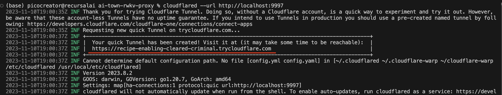
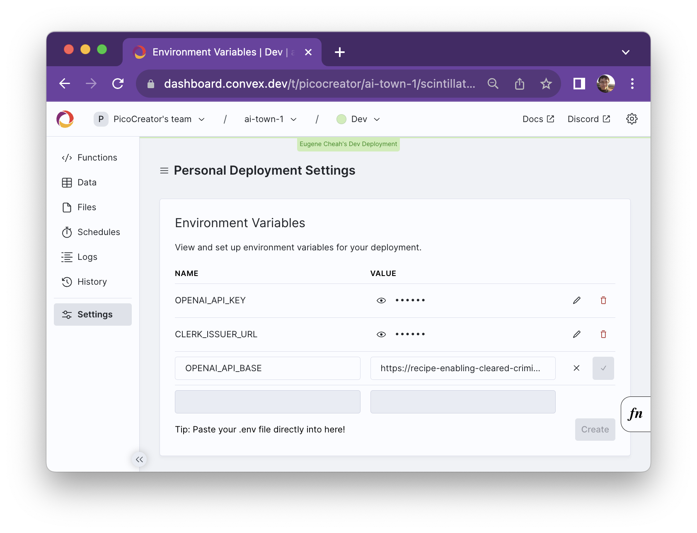

# AI Town - RWKV Proxy

Run a large AI town, locally, via RWKV !


The AI Model is based on RWKV, which you can find out more here : https://wiki.rwkv.com

> PS: You can now use https://aitown-demo-api.recursal.ai with your OPENAI_API_KEY , directly to run at scale instead.

# About RWKV

RWKV, is a linear transformer, without eval compromises, and with 10-100x lower inference cost, light weight enough that the 3B model can run on
- 16GB ram
- any modern CPU

If you want to push it lower, you can run the 1.5B model, which works on a raspberry pi with 8gb ram, but gets wierd results time to time

> PS: The code used here is not fully optimized, and there is definately lots of room to scale higher the bottlenecks (see low CPU usage)

# Setup steps

> Disclaimer: Currently it is not possible to run AI town 100% offline, as it requires
> - convex for the api backend + vector DB
> - openAI embeddings
>
> This project is to help put that a step closer, in running a full AI town locally on any modern device

## Step 1 - Setup AI town as per normal

See: https://github.com/a16z-infra/ai-town
Make sure it works first, before rerouting to RWKV

## Step 2 - Clone the AI-TOWN-RWKV-proxy project

```bash
git clone https://github.com/recursal/ai-town-rwkv-proxy.git
cd ai-town-rwkv-proxy

# (recommended) For running the 3B model on CPU
./setup-and-run-3B.sh

# (not recommended) only for very low-end devices, eg. raspberry pi's
./setup-and-run-1B5.sh

# If you want to run on the nvidia GPU, you can pass in "cuda bf16"
# more advance strategies can be found at : https://pypi.org/project/rwkv/
./setup-and-run-3B.sh "cuda bf16"
```

This will setup an API proxy (for embedding) + rwkv (for chat completion) at port 9997

## Step 3 - Deploy the AI Town proxy via cloudflared

Due to current limitations, you will need to route your RWKV AI model, through a public URL. There are multiple ways to do it, but the easiest and most reliable is cloudflared which you can install with

You will need to run this in another shell

```bash
npm install -g cloudflared

####
# PS: cloudflared was built for x86, if you are running on ARM based macs, you may need to get rosette installed
####
# softwareupdate --install-rosetta
# softwareupdate --install-rosetta --agree-to-license
```

After installing, you can get a public URL with just

```bash
# Create a public URL, pointing to port 9997 (which is what we run our API on for now)
cloudflared --url http://localhost:9997
```

This will give an output like the following



## Step 4 - Route the convex OpenAI request to the proxy

Under the convex environment settings, add the OPENAI_API_BASE (do not include the ending slash).
You will still need the openAI key, for the embeddings.



> PS: You can now use https://aitown-demo-api.recursal.ai with your OPENAI_API_KEY , directly to run at scale instead.

## Extra step - How do I scale up the character count

> At present, we only recommend scaling UP TO 75 characters, any more then that and there is stability issues on the AI town / convex side, for path finding, etc (not the AI model!!)
>
> Warning: It is very possible to hit the convex limits in a day or two with 75 characters, on the free tier

You can copy our character descriptions in [our ts file here](./character-description.ts)

Modify the last line to the number of characters `.slice(0, 75)`

Inside your AI town project under `data/character.ts`, replace the description accordingly.

You will need to reset your town for the change to take effect

```
# Nuke everything
npx convex run testing:stop
npx convex run testing:wipeAllTables

# Start again
npm run dev
```
